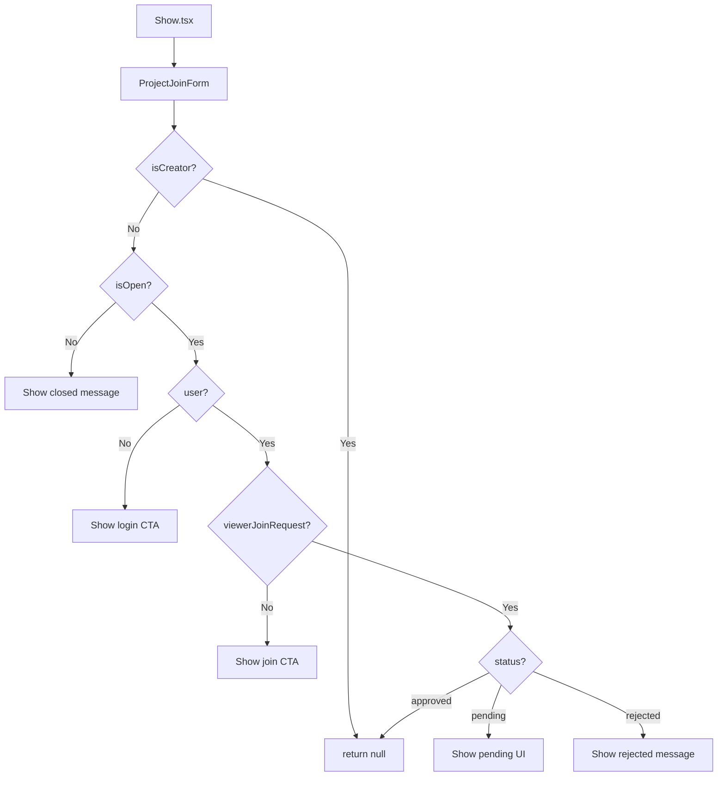

# Design: Project Join Request Lifecycle Visibility

## Technical Approach

This design extends the existing `projects/show` view to expose **approved** and **rejected** join-request states to the authenticated viewer, while enforcing **membership precedence** in the UI. The backend will expose the full lifecycle state via the `viewerJoinRequest` payload, and the frontend will use a **decision tree** to render the appropriate UI based on the simplified product rules.

The approach maps directly to the proposal and spec:
- **Backend**: Extend `JoinRequestService` and `ApiResourceTransformer` to expose `status` and `message` for all lifecycle states.
- **Frontend**: Update `ProjectJoinForm` to render a **rejected-state message** or **hide the section** for approved/participant states.
- **Testing**: Strict TDD with backend payload tests and frontend component tests for each precedence scenario.

## Architecture Decisions

### Decision: Extend `viewerJoinRequest` Payload Contract

**Choice**: Extend the existing `viewerJoinRequest` payload to include `status` (`pending` | `approved` | `rejected` | `null`) and `message` (`string | null`).

**Alternatives considered**:
- **New top-level field**: `viewerJoinRequestStatus` — redundant, breaks existing code.
- **Separate endpoint**: `/projects/{slug}/join-status` — adds latency, violates Inertia.js SPA pattern.

**Rationale**: The existing `viewerJoinRequest` field is already used for pending requests. Extending it keeps the payload **flat**, **backward-compatible**, and **aligned with Inertia.js** conventions. The frontend can use the same field for all lifecycle states.

---

### Decision: Membership Precedence in Frontend

**Choice**: Hide the join-request section entirely if the viewer is a **participant** or has an **approved** join request.

**Alternatives considered**:
- **Backend filtering**: Omit `viewerJoinRequest` for participants — violates payload contract, breaks frontend logic.
- **Conditional rendering in parent**: Move logic to `Show.tsx` — scatters responsibility, harder to test.

**Rationale**: The frontend **component** (`ProjectJoinForm`) is the **single source of truth** for join-request visibility. It already handles `isCreator`, `isOpen`, and `user` checks. Adding **membership precedence** here keeps the logic **cohesive**, **testable**, and **aligned with React best practices**.

---

### Decision: Rejected State Message

**Choice**: Render a **static informational message** with a `/projects` link for rejected applicants.

**Alternatives considered**:
- **Dynamic message**: Allow creators to customize rejection text — out of scope per spec.
- **Re-apply button**: Allow rejected applicants to re-apply — violates spec (no re-application flow).

**Rationale**: The spec explicitly calls for a **static message** explaining the project has started. This keeps the UX **simple**, **consistent**, and **aligned with product rules**. The `/projects` link provides a **clear next action** for rejected applicants.

---

### Decision: Approved State Handling

**Choice**: Hide the join-request section for approved applicants (no separate UI).

**Alternatives considered**:
- **Success message**: Show a confirmation — redundant, approved users are already participants.
- **Pending fallback**: Show pending UI — violates spec (approved users are members).

**Rationale**: The spec states that **approval implies membership**. The current system already attaches approved users as participants. Hiding the section **reduces noise** and **aligns with membership precedence**.

## Data Flow

### Backend Flow

```mermaid
flowchart TD
    A[ProjectController@show] --> B[JoinRequestService::getViewerFullRequest]
    B --> C{Viewer has
join request?}
    C -->|Yes| D[Return full lifecycle state]
    C -->|No| E[Return null]
    D --> F[ApiResourceTransformer::project]
    F --> G[Inertia::render]
```

### Frontend Flow



## File Changes

| File | Action | Description |
|------|--------|-------------|
| `app/Services/JoinRequestService.php` | Modify | Add `getViewerFullRequest()` to fetch all lifecycle states |
| `app/Http/Controllers/ProjectController.php` | Modify | Use `getViewerFullRequest()` instead of `getViewerPendingRequest()` |
| `app/Helpers/ApiResourceTransformer.php` | Modify | Extend `viewerJoinRequest` to include `status` and `message` |
| `resources/js/types/index.ts` | Modify | Update `Project.viewerJoinRequest` to include `message` |
| `resources/js/components/projects/show/project-join-form.tsx` | Modify | Add rejected-state message and membership precedence |
| `tests/Feature/ProjectTest.php` | Modify | Assert payload includes approved/rejected states |
| `resources/js/components/projects/show/project-join-form.test.tsx` | Modify | Assert precedence and rejected-state rendering |

## Interfaces / Contracts

### Backend Contract

```typescript
interface ViewerJoinRequest {
  id: number | null;
  status: 'pending' | 'approved' | 'rejected' | null;
  message: string | null; // Only for rejected state
}

interface ProjectShowPayload {
  ...Project,
  viewerJoinRequest: ViewerJoinRequest | null;
}
```

### Frontend Types

```typescript
// resources/js/types/index.ts
interface Project {
  ...
  viewerJoinRequest?: {
    id: number;
    status: 'pending' | 'approved' | 'rejected';
    message?: string | null; // Only for rejected state
  } | null;
}
```

## Testing Strategy

| Layer | What to Test | Approach |
|-------|-------------|----------|
| **Unit** | `JoinRequestService::getViewerFullRequest()` | Test returns `null`, `pending`, `approved`, `rejected` for different users |
| **Unit** | `ApiResourceTransformer::project()` | Test `viewerJoinRequest` includes `status` and `message` |
| **Feature** | `ProjectController@show` | Test payload contract for all lifecycle states |
| **Unit** | `ProjectJoinForm` | Test precedence: participant > approved > rejected > pending > no-request |
| **Unit** | `ProjectJoinForm` | Test rejected-state message and `/projects` link |
| **E2E** | `projects/show` | Manual smoke test for rejected message and precedence |

## Migration / Rollout

No migration required. This change is **backward-compatible**:
- Existing `pending` requests continue to work.
- New `approved`/`rejected` states are **additive** to the payload.
- Frontend changes are **non-breaking** (new branches, no removed behavior).

## Open Questions

- [ ] Should the rejected message include the **project creator's name**? (Spec currently omits this.)
- [ ] Should the `/projects` link open in a **new tab**? (Current design: same tab.)