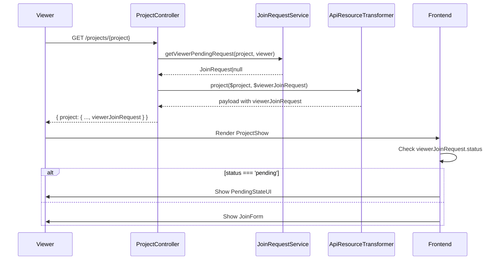

# Design: Project Join Request Visibility

## Technical Approach

This change implements **viewer-specific join request visibility** by:
- Extending the project show payload to include the authenticated viewer's pending join request (if any).
- Modifying the frontend to conditionally render the join form or a pending-state UI based on the `viewerJoinRequest` field.
- Preserving all existing contracts for `approved`/`rejected` requests while intentionally excluding them from this scope.

The design follows the **Service Layer Architecture** pattern, keeping controllers thin and delegating business logic to services. The `ProjectController@show` method explicitly delegates viewer join request lookup to a new `JoinRequestService` method. The frontend uses **React composition patterns** to maintain a clean separation of concerns.

## Architecture Decisions

### Decision: Payload Extension Over UI-Only Logic

**Choice**: Add `viewerJoinRequest` to the project show payload.
**Alternatives considered**:
- Client-side query for join request status (extra HTTP call, waterfall).
- UI-only logic (prone to race conditions, harder to test).
**Rationale**:
- Single HTTP call for all project data.
- Server-side logic ensures atomicity (no race conditions).
- Easier to test and maintain (contract locked via feature tests).

### Decision: Strict Scope Limitation to `pending` Requests

**Choice**: Only expose `viewerJoinRequest` for `pending` status.
**Alternatives considered**:
- Include all statuses (`approved`, `rejected`).
**Rationale**:
- `approved` users are already participants (no UI change needed).
- `rejected` users can re-apply (form should be visible).
- Reduces payload size and simplifies frontend logic.

### Decision: Service-Based Join Request Lookup

**Choice**: Extract viewer join request lookup to `JoinRequestService@getViewerPendingRequest`.
**Alternatives considered**:
- Query Eloquent directly in `ProjectController@show`.
- Create a new `ProjectViewerService` for viewer-specific logic.
**Rationale**:
- **Separation of concerns**: Business logic belongs in services, not controllers.
- **Reusability**: The same method can be reused for future endpoints (e.g., `projects.index`).
- **Testability**: Service methods are easier to unit test than controller logic.
- **Consistency**: Aligns with existing patterns (e.g., `ProjectService`, `JoinRequestService`).

### Decision: Minimal File Touch Set

**Choice**: Modify only 5 files (backend: 3, frontend: 1, tests: 1).
**Rationale**:
- Adds `JoinRequestService@getViewerPendingRequest` to centralize logic.
- Minimal changes reduce risk and review complexity.

## Data Flow



## File Changes

| File | Action | Description |
|------|--------|-------------|
| `app/Http/Controllers/ProjectController.php` | Modify | Delegate viewer join request lookup to `JoinRequestService` and pass result to transformer. |
| `app/Services/JoinRequestService.php` | Modify | Add `getViewerPendingRequest` method to fetch viewer's pending request. |
| `app/Helpers/ApiResourceTransformer.php` | Modify | Include `viewerJoinRequest` in project payload. |
| `resources/js/Pages/Project/Show.tsx` | Modify | Gate join form rendering by `viewerJoinRequest`. |
| `tests/Feature/ProjectTest.php` | Modify | Assert payload contract and visibility rules. |

## Interfaces / Contracts

### Backend Payload Contract

```typescript
interface ProjectShowPayload {
  id: number;
  title: string;
  // ... existing fields
  viewerJoinRequest: {
    id: number;
    status: 'pending';
    project_id: number;
    user_id: number;
  } | null;
}
```

### Frontend Props Contract

```typescript
interface ProjectShowProps {
  project: {
    // ... existing fields
    viewerJoinRequest: {
      id: number;
      status: 'pending';
    } | null;
  };
}
```

## Testing Strategy

| Layer | What to Test | Approach |
|-------|-------------|----------|
| **Unit (Backend)** | `ApiResourceTransformer::project()` includes `viewerJoinRequest`. | PHPUnit: Test transformer output with mock data. |
| **Unit (Backend)** | `JoinRequestService@getViewerPendingRequest` returns correct request. | PHPUnit: Test service method in isolation. |
| **Feature (Backend)** | Project show payload contract. | PHPUnit: Assert payload structure for authenticated viewers. |
| **Feature (Backend)** | Visibility rules for `pending` requests. | PHPUnit: Assert `viewerJoinRequest` presence/absence based on status. |
| **Unit (Frontend)** | Join form visibility logic. | Vitest: Test `ProjectJoinForm` rendering conditions. |
| **E2E** | Full user flow (pending → cancel → re-apply). | Playwright: Simulate user interactions. |

**TDD Workflow**:
1. Write failing feature test for payload contract (`viewerJoinRequest` field).
2. Implement `JoinRequestService@getViewerPendingRequest`.
3. Update `ProjectController@show` to delegate to the service.
4. Update `ApiResourceTransformer` to include the field.
5. Write failing feature test for visibility rules (pending → no form).
6. Implement frontend changes to pass the test.
7. Refactor (e.g., extract `PendingStateUI` component).

## Migration / Rollout

No migration required. The change is additive:
- New field (`viewerJoinRequest`) is `null` by default.
- Existing UI remains unchanged for users without pending requests.
- Rollback: Revert the 5 modified files.

## Open Questions

- [ ] Should `viewerJoinRequest` be included in the `projects.index` payload for consistency? (Current scope: `show` only.)
- [ ] Is the `PendingStateUI` copy (`"Tu solicitud está pendiente"`) final, or should it be configurable?
- [ ] Should the cancel button trigger a confirmation dialog? (Current: Direct action.)